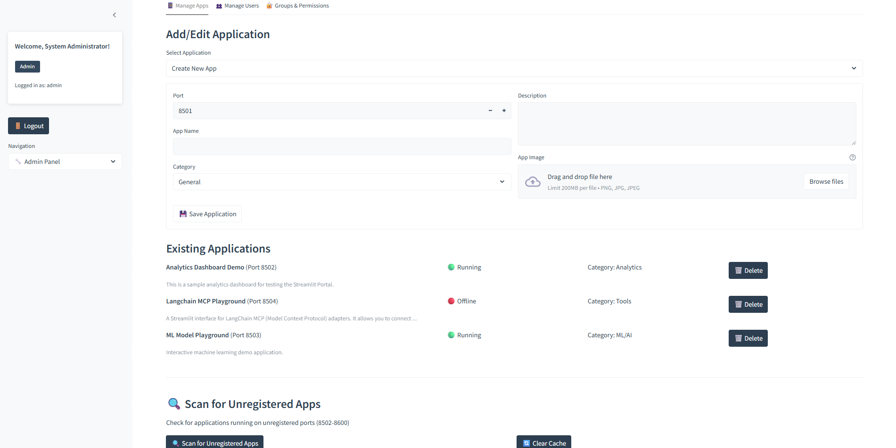
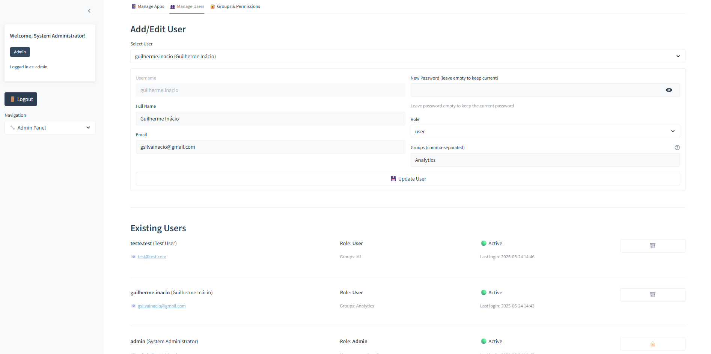
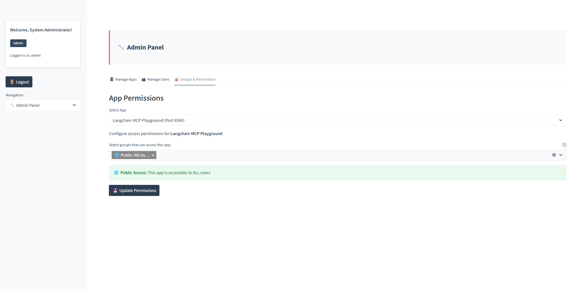
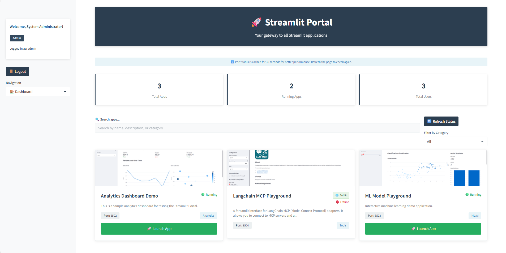

# Streamlit Portal Server

A comprehensive, production-ready server solution that transforms your Streamlit deployment into a powerful portal with advanced authentication, full user management, automated app discovery, and modern UI design. Perfect for enterprise environments running multiple Streamlit applications.

## Key Features

### Advanced Authentication & Security
- **Secure user login/logout** with bcrypt password hashing
- **Role-based access control** (Admin/User roles)
- **Session management** with automatic timeout
- **Group-based permissions** for granular access control
- **Protected user accounts** (prevent deletion of admin/current user)

### Complete User Management
- **Full CRUD operations** - Create, Read, Update, Delete users
- **Smart user editing** with form pre-population
- **Flexible user information** (username, full name, email, role)
- **Group membership management** with comma-separated input
- **User activity tracking** with last login timestamps
- **Safety protections** against accidental admin deletion
- **Password management** with optional password updates

### Advanced Application Management
- **Auto-discovery** of running Streamlit applications
- **Full app lifecycle** - Create, edit, delete, monitor
- **Rich app metadata** (name, description, category, custom images)
- **Port scanning** for unregistered applications (8502-8600 range)
- **Real-time status monitoring** with caching for performance
- **Category-based organization** with filtering
- **Image upload support** with automatic resizing and optimization

### Smart App Discovery
- **Automated port scanning** with multithreaded performance
- **HTTP verification** to confirm Streamlit applications
- **Cache management** (1-minute TTL) for optimal performance  
- **Exclusion of registered ports** to show only new discoveries
- **Direct launch buttons** for unregistered apps
- **Scan statistics** and status reporting

### Modern UI/UX Design
- **Professional mature theme** with dark blue-gray color scheme
- **Minimal border radius** (4px) for contemporary look
- **Responsive card-based layouts** with CSS Grid/Flexbox
- **Custom Streamlit theming** via `.streamlit/config.toml`
- **Consistent design language** across all components
- **Hover effects and smooth transitions**
- **Status indicators** (🟢 Running, 🔴 Offline, 🟢 Active, 🔴 Inactive)

### Granular Permission System
- **Group-based access control** with flexible group assignment
- **Per-application permissions** configuration
- **🌐 Public Access** - Apps accessible to all users without group restrictions
- **Admin oversight capabilities** with full system access
- **Automatic permission inheritance** for new users
- **Visual permission management** interface

### Performance Optimizations
- **Intelligent caching** with `@st.cache_data` decorators
- **Optimized port checking** (30-second TTL for status, 60-second TTL for scans)
- **Multithreaded port scanning** (max 50 workers) with timeout handling
- **Selective port monitoring** (only check accessible apps per user)
- **Lazy loading** for large datasets and images

## Quick Start

### Prerequisites
- **Python 3.8+**
- **Required packages** (automatically installed via requirements.txt)

### Installation

**Recommended: Using UV (Fast & Modern)**

1. **Install UV** (if not already installed):
   ```bash
   # On Windows
   powershell -ExecutionPolicy ByPass -c "irm https://astral.sh/uv/install.ps1 | iex"
   
   # On macOS/Linux
   curl -LsSf https://astral.sh/uv/install.sh | sh
   ```

2. **Clone the repository**:
   ```bash
   git clone https://github.com/guinacio/streamlit-portal-server.git
   cd streamlit-portal-server
   ```

3. **Install dependencies with UV**:
   ```bash
   uv sync
   ```

4. **Run the portal**:
   ```bash
   uv run streamlit run app.py
   ```

5. **Access the portal**:
   Open your browser and navigate to `http://localhost:8501`

**Alternative: Using pip**

If you prefer using pip or don't want to install UV:

```bash
# After cloning the repository
pip install -r requirements.txt
streamlit run app.py
```

> **💡 Why UV?** UV is significantly faster than pip, has better dependency resolution, and provides more reliable virtual environment management. It's the modern choice for Python package management.

### Default Admin Credentials
- **Username**: `admin`
- **Password**: `admin123`

⚠️ **Security Notice**: Change the default admin password immediately after first login!


## Comprehensive Usage Guide

### For Administrators

#### 1. **Advanced Application Management**
Navigate to **Admin Panel → Manage Apps**



**Adding/Editing Applications:**
- Select "Create New App" or choose existing app from dropdown
- Configure port number, name, description, and category
- Upload custom images (PNG, JPG, JPEG) with automatic optimization
- Form pre-populates when editing existing apps
- Save changes with real-time validation

**Managing Existing Apps:**
- View all apps with status indicators (🟢 Running, 🔴 Offline)
- Edit any application by selecting it from the dropdown
- Delete applications with confirmation (removes from permissions too)
- Monitor app categories and descriptions

**Automated App Discovery:**
- Click "🔍 Scan for Unregistered Apps" to find running apps on ports 8502-8600
- Results are cached for 1 minute for performance
- Automatically excludes already registered ports
- Direct "Open" buttons to launch unregistered apps
- Clear cache button for fresh scans

#### 2. **Complete User Management**
Navigate to **Admin Panel → Manage Users**



**Creating/Editing Users:**
- Select "Create New User" or choose existing user from dropdown
- Configure username (locked when editing), full name, email
- Set role (admin/user) and assign to groups (comma-separated)
- Password management: optional updates (leave empty to keep current)
- Form pre-populates all fields when editing

**User Overview:**
- Visual user cards showing username, full name, and email
- Role and group membership display
- Activity status (🟢 Active, 🔴 Inactive)
- Last login timestamps with formatted dates
- Individual delete buttons with safety protections

**Safety Features:**
- Cannot delete admin user or currently logged-in user
- Protected users show 🔒 icon instead of delete button
- Automatic cleanup removes users from all groups when deleted
- Transaction safety prevents data corruption

#### 3. **Permission Management**
Navigate to **Admin Panel → Groups & Permissions**



**Setting App Permissions:**
- Select application from dropdown
- Choose which user groups can access the app
- **🌐 Public (All Users)**: Select this option to make an app accessible to ALL users, regardless of group membership
- Multi-select interface with current permissions pre-selected
- Save changes with immediate effect
- Visual feedback for successful updates

**Access Levels:**
- **🌐 Public Access**: App is accessible to all users (great for common tools, dashboards everyone needs)
- **🔒 Group Access**: App is only accessible to users in specific groups  
- **⚠️ No Access**: App is not accessible to any users

#### 4. **System Monitoring**
- **Dashboard Statistics**: Total apps, running apps, total users (admin view)
- **Port Status Caching**: 30-second cache for app status checks
- **Performance Metrics**: Scan timing and success rates
- **User Activity**: Login timestamps and activity monitoring

### For Users



#### 1. **Accessing Applications**
- **Dashboard View**: See all applications you have permission to access
- **Smart Filtering**: Search by name, description, or category
- **Category Filtering**: Filter apps by category (General, Analytics, ML/AI, etc.)
- **Status Indicators**: Know which apps are running (🟢) or offline (🔴)

#### 2. **Launching Applications**
- Click **"🚀 Launch App"** on running applications
- Apps open in new browser tabs for seamless workflow
- Only applications you have group permissions for are displayed
- Direct access to registered and unregistered apps

#### 3. **User Experience Features**
- **Responsive Design**: Works on desktop, tablet, and mobile
- **Real-time Updates**: Status refreshes automatically
- **Performance Optimized**: Fast loading with intelligent caching
- **Modern Interface**: Professional design with smooth interactions

## Architecture

## Configuration & Customization

### File Structure
```
streamlit-portal-server/
├── app.py                    # Main Streamlit application
├── database.py              # Database operations and models  
├── utils.py                 # Utility functions and helpers
├── requirements.txt         # Python dependencies
├── .cursorrules            # AI development guidelines
├── .streamlit/
│   └── config.toml         # Streamlit theme configuration
├── app_images/             # Uploaded app images (auto-created)
├── portal.db              # SQLite database (auto-created)
└── README.md              # This documentation
```

### Database Configuration
- **SQLite database** (`portal.db`) created automatically on first run
- **Automatic migrations** handle schema updates
- **Foreign key constraints** ensure data integrity
- **Indexed queries** for optimal performance

### Theme Customization
The portal uses a custom theme defined in `.streamlit/config.toml`:

```toml
[theme]
base = "light"
primaryColor = "#888888"           # Light gray for button text/interactions
backgroundColor = "#ffffff"        # Clean white background
secondaryBackgroundColor = "#f8f9fa"  # Subtle gray for cards
textColor = "#2c3e50"              # Professional dark gray
linkColor = "#2980b9"              # Theme blue for links
```

### Port Range Configuration
Modify the scanning range in `display_unregistered_ports()`:
```python
# Scan ports 8502-8600 (default)
unregistered_ports = scan_unregistered_ports_cached(8502, 8600, registered_ports)
```

### Categories Customization
Add new categories in `manage_apps_tab()`:
```python
category = st.selectbox("Category", 
    ["General", "Analytics", "ML/AI", "Dashboard", "Tools", "Games", "Your-Category"])
```

## Development & Testing

### Running Multiple Test Apps
Test the portal with multiple Streamlit applications:

1. **Create test applications**:
   ```bash
   mkdir test_apps && cd test_apps
   mkdir app1 app2 app3
   ```

2. **Create simple test apps**:
   ```python
   # test_apps/app1/main.py
   import streamlit as st
   st.title("Analytics Dashboard")
   st.write("Sample analytics application")
   st.bar_chart({"data": [1, 2, 3, 4, 5]})
   ```

3. **Run on different ports**:
   ```bash
   # Terminal 1
   cd test_apps/app1 && streamlit run main.py --server.port 8502
   
   # Terminal 2  
   cd test_apps/app2 && streamlit run main.py --server.port 8503
   
   # Terminal 3
   cd test_apps/app3 && streamlit run main.py --server.port 8504
   ```

4. **Configure in portal**:
   - Login as admin
   - Use "Scan for Unregistered Apps" to auto-discover
   - Register apps with proper names, descriptions, and categories
   - Create user groups and set permissions
   - Test access with different user accounts

### Development Guidelines
The project includes `.cursorrules` file with comprehensive development guidelines:
- **Multi-line editing**: Always use `edit_file` tool for multi-line changes
- **File encoding**: UTF-8 without BOM, consistent line endings
- **Code quality**: PEP 8 compliance, type hints, error handling
- **Performance**: Caching strategies, efficient database queries
- **Security**: Input validation, SQL injection prevention

## Security Features

### Enterprise-Grade Security
The Streamlit Portal implements multiple layers of security to protect against unauthorized access and ensure safe application deployment in enterprise environments.

### Multi-Layer Authentication
- **Session-Based Security**: Advanced session management with secure token validation
- **Anti-Sharing Protection**: URLs cannot be shared between users or browsers
- **Automatic Token Expiration**: Access tokens expire automatically and are single-use only
- **Session Binding**: All access is cryptographically tied to authenticated portal sessions
- **Logout Protection**: When users log out, all their active sessions become invalid immediately

### Secure Access Control
- **Portal Session Validation**: Database-backed session verification prevents unauthorized access
- **Token-to-Session Binding**: Access tokens are permanently linked to the portal session that created them
- **Cross-Platform Security**: Works reliably across different browsers and devices
- **Non-Repudiation**: Clear audit trail of who accessed what and when

### Application Protection
Each Streamlit application can be secured using the included security library:
```python
from portal_security import require_portal_access

# At the top of your Streamlit app
require_portal_access(app_id=1)  # Your app's ID from the portal database
```

### Security Best Practices

#### Authentication Security
- **bcrypt password hashing** with salt for secure storage
- **Session management** prevents unauthorized access
- **Role-based permissions** limit access based on user roles
- **Input validation** on all user inputs to prevent injection attacks
- **Secure session cookies** with HttpOnly and SameSite protection

#### Database Security  
- **Parameterized queries** prevent SQL injection
- **Foreign key constraints** maintain data integrity
- **Transaction safety** ensures atomic operations
- **Connection management** with proper cleanup
- **Session state protection** with database validation

#### Access Security
- **Group-based permissions** for granular access control
- **Public/private app designation** with clear security boundaries
- **Admin privilege separation** with protected account controls
- **Automatic session cleanup** removes expired sessions
- **Single-use tokens** prevent replay attacks

#### Network Security
- **Port scanning protection** with controlled discovery ranges
- **HTTP verification** ensures only legitimate applications are discovered
- **Cross-origin protection** prevents unauthorized embedding
- **Secure proxy architecture** with cookie-based session management

#### File Security
- **Image upload validation** (type, size restrictions)
- **Path sanitization** prevents directory traversal
- **Secure file storage** in designated directories
- **File type restrictions** with automatic processing

## Troubleshooting

### Common Issues & Solutions

1. **"No apps found" / Empty Dashboard**
   - Verify Streamlit apps are running on expected ports
   - Check user has group permissions for apps
   - Confirm apps are registered in admin panel
   - Use "Scan for Unregistered Apps" to auto-discover

2. **Authentication Problems**
   - Verify username/password spelling and case sensitivity
   - Check user account is active (not disabled)
   - Try with default admin credentials
   - Check database permissions and file access

3. **Port Scanning Issues**
   - Ensure ports 8502-8600 are not blocked by firewall
   - Check if services are actually Streamlit apps (HTTP verification)
   - Clear scan cache if results seem stale
   - Verify multithreading isn't blocked by system limits

4. **Image Upload Problems**
   - Check `app_images/` directory is writable
   - Verify file format (PNG, JPG, JPEG only)
   - Ensure PIL/Pillow is correctly installed
   - Check file size limits (images are auto-resized)

5. **Database Errors**
   - Ensure directory is writable for SQLite file creation
   - Check `portal.db` file permissions
   - Verify no conflicting database connections
   - Restart application if database is locked

6. **Theme/UI Issues**
   - Verify `.streamlit/config.toml` file is present
   - Clear browser cache to refresh CSS
   - Check for JavaScript console errors
   - Ensure Streamlit version supports theme features

## Contributing

We welcome contributions! Here's how to get involved:

### Reporting Issues
- Use GitHub Issues with detailed reproduction steps
- Include system information (OS, Python version, Streamlit version)
- Provide logs and error messages when applicable

### Suggesting Features
- Check existing issues for similar requests
- Provide detailed use cases and expected behavior
- Consider backwards compatibility and security implications

### Code Contributions
- Follow the `.cursorrules` development guidelines
- Write tests for new features
- Update documentation for changes
- Use consistent code style and commenting

## License

This project is open source and available under the **MIT License**.

## Acknowledgments

Built with these amazing technologies:

- **[Streamlit](https://streamlit.io/)** - The powerful Python web app framework
- **[SQLite](https://sqlite.org/)** - Lightweight, reliable database engine  
- **[bcrypt](https://github.com/pyca/bcrypt)** - Secure password hashing
- **[Pillow](https://python-pillow.org/)** - Python image processing library
- **[pandas](https://pandas.pydata.org/)** - Data manipulation and analysis

